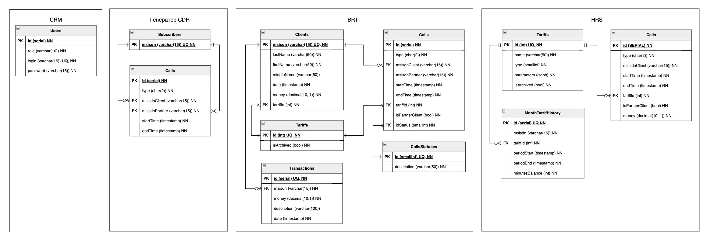

# Nexign Bootcamp

Проект, разработанный в рамках Nexign Bootcamp 2025, представляет собой распределённую систему из четырёх микросервисов,
эмулирующих работу мобильного оператора. Основная цель — автоматизация процессов фиксации звонков (CDR), тарификации,
биллинга и управления клиентами. Каждый микросервис отвечает за отдельный этап жизненного цикла данных: генерация
CDR-записей (эмулятор коммутатора), их обработка и хранение (BRT), расчёт стоимости услуг по тарифам (HRS), а также
предоставление API для абонентов и менеджеров (CRM). Коммуникация между сервисами реализована через RabbitMQ и REST API,
а для хранения используются PostgreSQL и H2.

Система поддерживает два типа тарифов (классический и помесячный), учитывает особенности тарификации, включая округление
по минутам, и предусматривает отрицательный баланс. Решение построено на Java 17 с использованием Spring Boot, Security,
Cloud и других компонентов. разворачивается с помощью Docker Compose.

## Схема базы данных отдельных микросервисов



## CDR

CDR-сервис эмулирует работу телефонного коммутатора, генерируя звонки между абонентами, сохраняя их в базе, формируя
CDR-файлы и отправляя их в биллинговую систему через RabbitMQ.


---

## 🔹 POST `/calls/generate`

### Описание

Генерация случайных звонков между абонентами. Все записи сохраняются в базу данных.

### Параметры запроса

| Параметр | Тип   | Обязательный | Описание                         |
|----------|-------|--------------|----------------------------------|
| `count`  | `int` | да           | Количество звонков для генерации |

### Пример запроса

POST /api/calls/generate?count=100


---

## 🔹 GET `/reports/latest`

### Описание

Скачивание последнего сформированного CDR-файла в формате CSV.

### Ответы

- **200 OK** — Возвращает CSV-файл с 10 последними CDR-записями.
    - Заголовки:
        - `Content-Disposition: attachment; filename="cdr_2025-05-12_10-00-00.csv"`
        - `Content-Type: text/csv`
- **404 Not Found** — CSV-файл не найден.

Логика генерации звонков в сервисе основывается на случайном выборе абонентов из базы данных и создании записей о
звонках между ними. Каждый звонок имеет случайную продолжительность от 1 минуты до 1 часа. Время начала звонка
генерируется случайным образом в пределах последнего года, а время окончания вычисляется на основе случайной
продолжительности. Если звонок пересекает полночь, создаются две отдельные записи — одна на день начала звонка, другая —
на следующий день. Каждая запись сохраняется с информацией о типе вызова (исходящий или входящий), номере вызывающего
абонента, номере принимающего и времени начала и окончания.

Для обеспечения уникальности звонков и предотвращения наложения событий для одного абонента, система применяет
фильтрацию по времени. Все звонки сортируются по времени и проверяются на пересечения. Если два звонка для одного
абонента имеют пересекающиеся временные интервалы, один из них отбрасывается. После этого, для каждой записи
генерируются зеркальные звонки (обратные вызовы), где меняются местами инициатор и получатель. Генерация и сохранение
звонков происходит пакетами для оптимизации работы с базой данных.

Сервис CallDeliveryService отвечает за отправку звонков в очередь RabbitMQ. Каждые 5 секунд он извлекает из базы данных
первые 10 звонков, отправляет их в очередь с использованием RabbitTemplate и затем удаляет эти звонки из базы. В случае
возникновения ошибки при отправке данные не удаляются, и сервис пытается снова. Это позволяет эффективно обрабатывать
звонки в фоновом режиме, обеспечивая их доставку в очередь для дальнейшей обработки.

## HRS

Описание тарифов было принято хранить в формате JSONB пример двух базовых тарифов:

```json
{
  "id": 11,
  "name": "Классика",
  "type": 1,
  "description": " Исходящие звонки: Абонентам «Ромашка» = 1.5 у.е./минута; Абонентам других операторов = 2.5 у.е./минута. Входящие звонки: бесплатно.",
  "outgoingCalls": {
    "internal": {
      "costPerMinute": 1.5,
      "currency": "у.е."
    },
    "external": {
      "costPerMinute": 2.5,
      "currency": "у.е."
    }
  },
  "incomingCalls": {
    "costPerMinute": 0,
    "currency": "у.е."
  }
}
```

```json
{
  "id": 12,
  "name": "Помесячный",
  "type": 2,
  "description": "50 минут включено на входящие/исходящие звонки, с 51 минуты расчет по тарифу 'Классика'",
  "monthlyFee": 100,
  "currency": "у.е.",
  "includedMinutes": 50,
  "overlimitTariffId": 11,
  "callTypes": {
    "outgoing": {
      "internal": true,
      "external": true
    },
    "incoming": true
  }
}
```

В дальнейшим это мапится в Map. Такое решение позволило нам задавать в базе данных тарифы любого формата, а в дальнейшем
позволит описать и более сложные расчеты списания по абоненты
Внутри HRS мы также храним минуты пользователя, если у него месячный тариф, и в случае окончание минут мы последующие
звонки рассчитываем по классическому тарифу. В начале каждого дня сервис просматривает всех пользователей, которым нужно
обновить тариф.

## BRT

Сервис BRT предназначен для обработки данных о звонках абонентов оператора «Ромашка», управления их балансами и
взаимодействия с системой тарификации HRS. Он принимает CDR-файлы от генератора CDR через RabbitMQ, фильтрует записи,
сохраняет их в базу данных и передаёт в HRS для расчёта стоимости. BRT также обеспечивает регистрацию новых абонентов,
смену тарифов, пополнение баланса и предоставление информации о клиентах. Сервис поддерживает статусы обработки звонков,
логирует транзакции и обрабатывает ошибки, обеспечивая надёжное взаимодействие между CRM, HRS и системой биллинга.
Данные хранятся в реляционной БД, включая таблицы абонентов, звонков, тарифов и транзакций.

## CRM

В конфигурации проекта можно задать логин и пароль администратора. Для безопасности запросов используется
BasicAuthentication. В дальнейшем можно рассмотреть и более простые варианты. CRM связывается с BRT посредству REST.

## Схема взаимодействия сервисов

### cdr ↔ brt:

cdr генерирует CDR-записи и отправляет их в brt через RabbitMQ.

### brt ↔ hrs:

brt запрашивает и получает данные от hrs через REST для тарификации и биллинга.

### crm ↔ brt:

crm взаимодействует с brt для обработки запросов от абонентов и модераторов через REST API.


